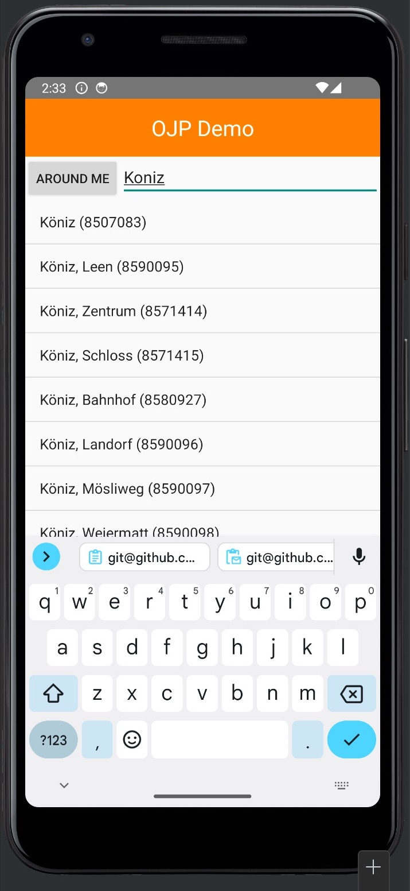

# OJP Android Demo App
Android Demo app to implement OJP APIs

## Install

- clone this repo and open it in Android Studio
- register OJP API key from [opentransportdata.swiss](https://opentransportdata.swiss/en/)
- update key in [/ojp/network/OJPServiceAPI.kt](./app/src/main/java/com/example/ojp_android_demo/ojp/network/OJPServiceAPI.kt)
